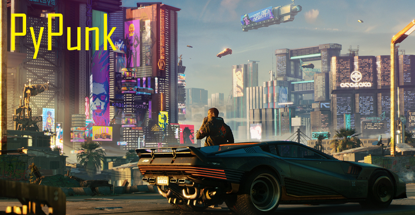

# PyPunk

PyPunk is a project aimed at building and training a self-driving car within the popular video game _Cyberpunk 2077_. The goal is to harness the power of AI and computer vision to create an autonomous vehicle capable of navigating the complex and dynamic environment of *Night City*. Remember, this is a project that is very much in progress...

## Project Overview

The project will involve the following key components:

    R&D: Some scripts and notebooks in a 'playground' in order to understand the cv2 library better and how to work on a self-driving car system.

    Data Collection: Extract and preprocess game footage to obtain relevant training data, including images of the in-game environment and corresponding vehicle control inputs.

    Model Training: Utilize a deep learning framework to train a model on the collected data, learning how to predict appropriate control inputs based on the environment.

    Integration: Implement the trained model within the Cyberpunk 2077 game, allowing the vehicle to navigate autonomously.

    Evaluation & Optimisation: Continuously evaluate the performance of the self-driving car and optimise the model to improve its navigation capabilities.

## Getting Started

To get started with the PyPunk project, clone this repository and follow the instructions provided in the setup guide. As development progresses, more detailed documentation will be added to help contributors and users understand the project's structure, dependencies, and usage.

## Contributing

Contributions to the PyPunk project are welcome! If you're interested in participating, please submit a pull request or open an issue to discuss your ideas. I've never started a computer vision project before and I'm happy to hear from others.

## License

PyPunk is released under the MIT License.

## Acknowledgments

Special thanks to the Cyberpunk 2077 development team for creating the immersive world of Night City, which serves as the inspiration and foundation for this project.