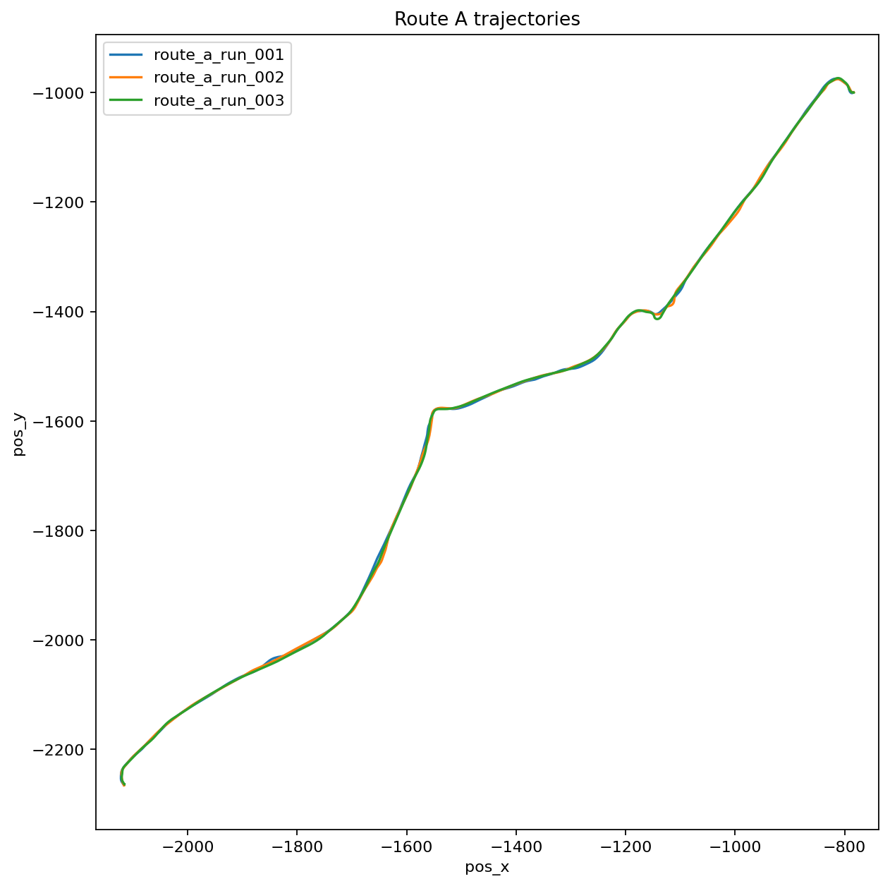
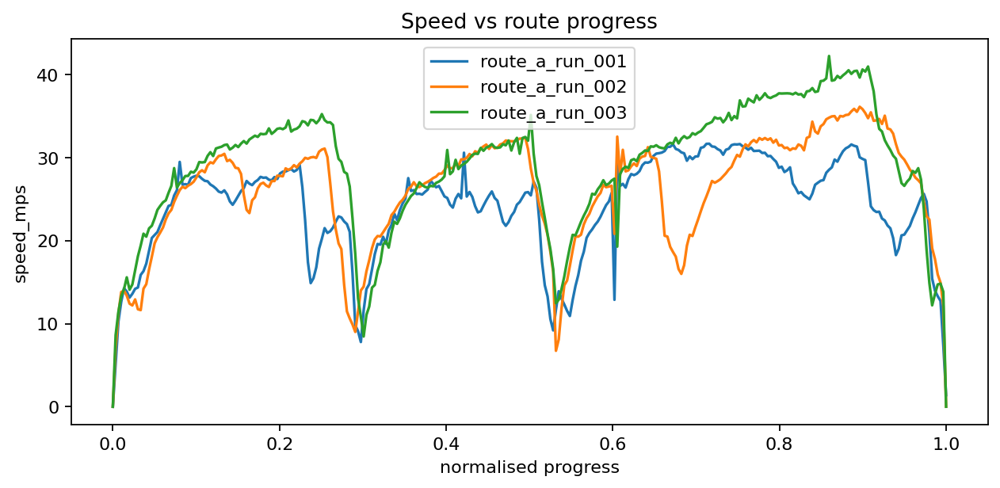

# PyPunk: first telemetry milestone

## Overview

this note records the first successful end-to-end telemetry milestone for PyPunk.

the goal of this stage was not training. the goal was to prove that i could:

1. run a cyber engine tweaks mod inside the game,
2. export structured telemetry to disk,
3. ingest that telemetry into python,
4. enrich the data with derived kinematics,
5. compare repeated human demonstrations on the same route.

that part is now working.

## Environment and setup

the project managed with `uv` inside WSL Ubuntu. the game-side integration currently uses a small cyber engine tweaks probe mod. that mod writes newline-delimited JSON (`.jsonl`) into the CET mod folder, and python then ingests those logs into parquet. at this stage, the logger is intentionally minimal. it records position and basic episode metadata, while velocity and speed are currently derived using python from finite differences.

## Telemetry pipeline

the telemetry pipeline currently has the following stages:

1. **Game-side logging**
   - cyber engine tweaks mod writes raw JSONL.
   - one row is emitted per sample step.
   - the logger preserves the last valid position when writing the terminal shutdown row.

2. **Raw ingestion**
   - raw `.jsonl` is copied into `telemetry/raw/`.
   - python ingests raw telemetry and writes normalised parquet into `telemetry/processed/`.

3. **Validation**
   - processed telemetry is checked for schema consistency and basic sanity.

4. **Enrichment**
   - velocity and speed are derived from position and elapsed time.
   - this gives the first physically meaningful kinematic signal without needing direct vehicle velocity from the game yet.

## Early issues fixed

### Terminal row corruption

the first logger version wrote a terminal row with position `(0, 0, 0)` on shutdown. that created a fake jump at the end of each run. i fixed this by caching the last valid sampled position and reusing it when emitting the terminal row.

## Route A repeated-run experiment

to test whether the pipeline was producing consistent demonstrations, three human-driven runs were recorded on the same route (`route_a`). this was done to reduce environmental variance and answer a simpler question first:

> can the project capture repeated demonstrations of the same route with enough consistency to support route-relative learning later?

### Result

yes.

### Trajectory consistency

the three recorded trajectories lie almost directly on top of one another over the full route.

this indicates:

- stable position logging,
- consistent coordinate handling,
- good enough data quality for building a reference route.

Saved plot:

### Speed consistency

the speed-vs-progress profiles are noisier than the trajectory overlays, but still broadly consistent. this is expected. human driving tends to align strongly in path geometry before it aligns tightly in speed choice and control smoothness. the broad braking and acceleration structure appears in similar regions of the route across all three runs, which is enough to justify the next step.

Saved plot:

## What this milestone proves

At this point, the project has demonstrated:

- working game-side telemetry export,
- working Python ingestion and parquet normalization,
- basic validation and enrichment,
- repeatable route-level human demonstrations,
- a usable basis for building route-relative features.

This means the project can now move beyond raw world coordinates and start representing the task in a more learning-friendly way.

## Next step

the next planned step is to build a **reference route representation** from the repeated runs.

that means computing route-relative quantities such as:

- progress along route,
- lateral deviation from the route,
- heading error relative to route tangent.

those features will be more useful for both imitation learning and reinforcement learning than raw world coordinates alone.

## Current limitations

the current logger still has important gaps:

- `yaw_rad` is not yet logged directly from the game,
- velocity is still derived rather than read from authoritative game state,
- steering, throttle, and brake are not yet logged as true player control inputs,
- run segmentation still depends on ending the game session.

these are acceptable limitations for the current stage, but they will need to be improved before behavioural cloning on true control actions.

## Summary

first telemetry milestone is complete. we can now extract stable driving traces from cyberpunk 2077, process them in python, and compare repeated demonstrations on a fixed route. the repeated-run overlay looks strong enough to justify moving on to route-relative features.
